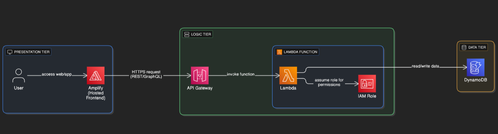

# AWS Currency Converter App 💱

This project is a **hands-on exploration of AWS three-tier architecture**, where I built and deployed an **end-to-end currency conversion application** using serverless services.

## 🚀 What is built
- **Frontend (Presentation Tier):**
  - Static HTML + Bootstrap app hosted on **AWS Amplify**.
  - Simple form to convert between currencies.
- **Application Tier (Logic):**
  - **AWS Lambda** function (Python) implementing conversion logic.
  - Exposed via **API Gateway** routes (`/convert`, `/rates`).
- **Data Tier (Storage):**
  - **DynamoDB** for storing cached currency rates and (optional) user conversion history.

## 🏗️ Architecture (3-tier)

## ✨ Features
- Fetches and caches currency rates in DynamoDB.
- Cross-rate support (EUR → USD even if only USD base cached).
- Bootstrap frontend with recent-conversions list.
- Full AWS-native stack: Amplify, API Gateway, Lambda, DynamoDB.

## 🛠️ Technologies
- **AWS Amplify** (Frontend Hosting)
- **Amazon API Gateway** (REST endpoints)
- **AWS Lambda** (Python backend)
- **Amazon DynamoDB** (NoSQL storage)
- **boto3** (AWS SDK for Python)
- **Bootstrap 5** (UI styling)
